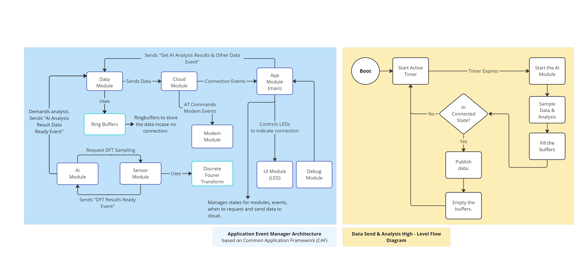
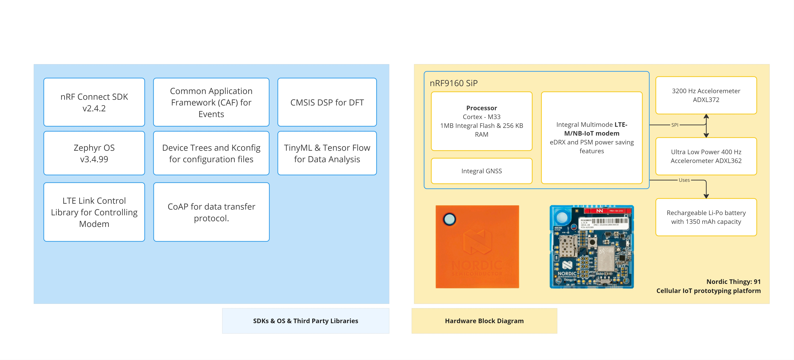
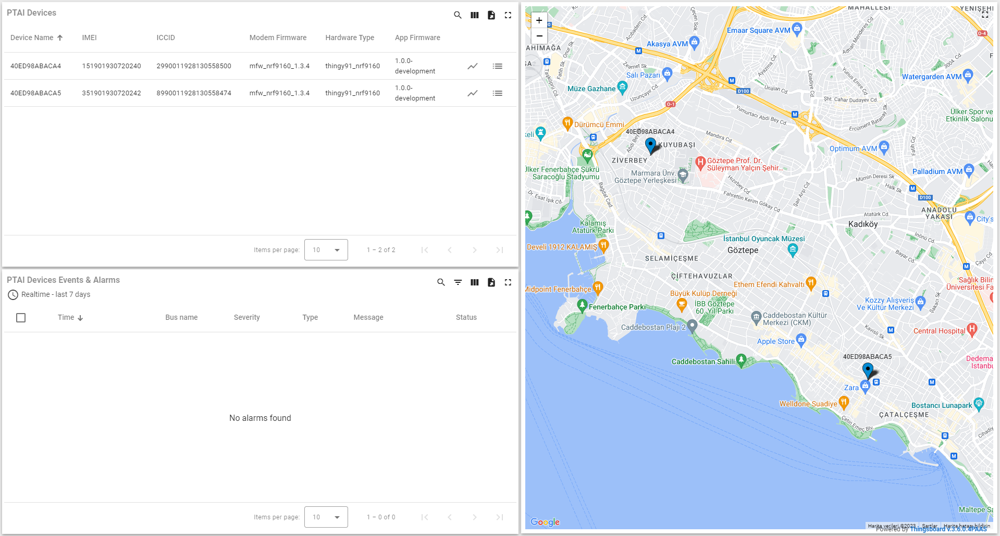
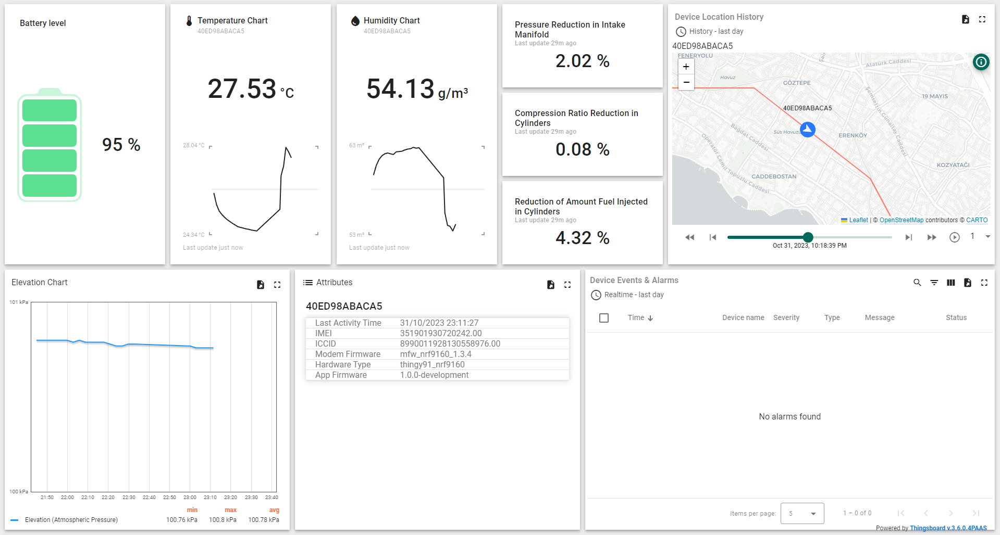

## PTAI Embedded IoT Device

The firmware is based on the [NRF Asset Tracker V2 example](https://developer.nordicsemi.com/nRF_Connect_SDK/doc/latest/nrf/applications/asset_tracker_v2/README.html), with added support for the Thingsboard IoT Device Management platform that uses CoAP as a communication protocol.

**The purpose** of this project is to predict the maintenance date of a mechanical device by analyzing various measurements from the sensors and sending these results to Thingsboard via CoAP and NB-IoT.

Please check the example and the [docs folder](ai_tag/docs) folder for further information related to the application.

### Embedded Firmware Architecture 

### Hardware & Firmware Infographic

## Usage

Here's how to run it:

1. If you are running this for the first time, *Device Profile* given in the [folder](thingsboard/dieselmotor.json) should be imported to Thingsboard to load the necessary configurations. If an error happens while importing you can also create your own profile and select the CoAP as a transport protocol. 

2. In the `overlay-thingsboard.conf` file, the hostname, device provision key, and device provision secret should be filled. The provision key and provision secret can be obtained from the *Device Profiles* in Thingsboard.

3. Because device provision **is currently not supported**, a new device should be created using the 'Add Device' option in the Entities/Devices profile in Thingsboard IoT interface. *Device Profile* that is used in the previous step should be used here.

4. After the device is created, click on the device and obtain the access token via the 'Manage Credentials' button. Fill in the device token configuration in the overlay file.

5. Add the overlay while building the application.

6. Flash the app, and you are ready to go.

### Mocking Data for Thingsboard (Fast Way)

To mock the messages supported by the device, you can read the given [documentation.](thingsboard/data_types.md). 

## Thingsboard UI

Pre-made UIs for the device are available in the Thingsboard. To use these UIs, you need to import them into Thingsboard. They are located in the given [folder](thingsboard/ptai_dashboard.json) named `ptai_dashboard.json.`

## To-Do List

### CoAP Communication
- [x] Being able to send any data via CoAP.
- [ ] To be able to read the response from the CoAP message and relay this information to upper layers. 
- [ ] Support the DNS resolve. This is something related to modem configurations, DNS server should be added via AT commands to modem.

### Thingsboard Communication
- [x] Being able to send any telemetry data to specified device in Thingsboard via JSON. 
- [ ] Being able to send any telemetry data to specified device in Thingsboard via Protobuf. 
- [ ] Being able to send device attributes to Thingsboard.
- [ ] Being able to provision a non-registered device to Thingsboard.

### Sensor Analysis
- [ ] Being able to start a accelometer sample for given seconds in given interval. 
- [ ] To able to do FFT analysis on accelometer measurements via CMSIS-DSP

### AI
- [ ] Implementing an AI model capable of detecting unusual behaviours in the given FTT results and running this model in the device.
